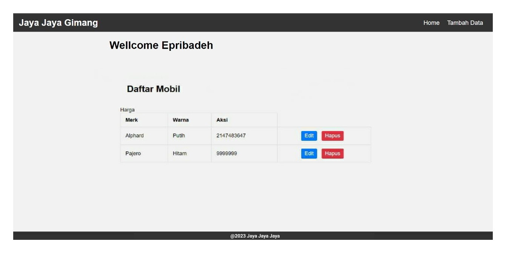
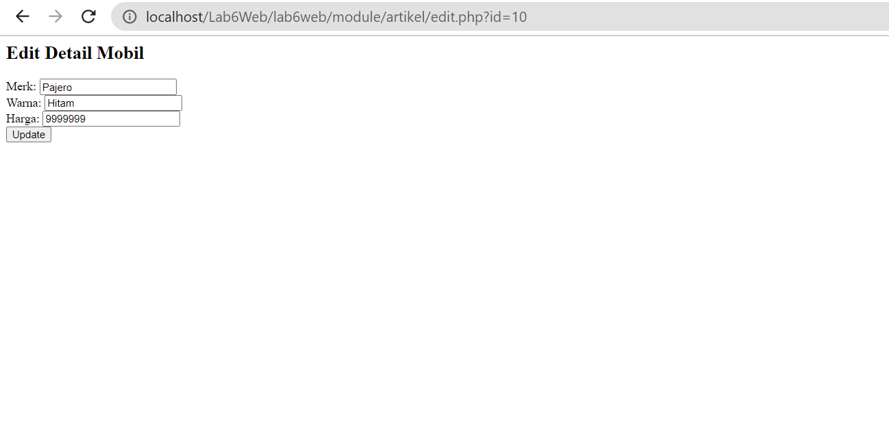

# Tugas Pemrograman Web 2
# Praktikum 6- OOP Lanjutan
## Profile
<body>
    <table border="1">
        <tr>
            <th> Nama</th>
            <th>NIM</th>
            <th>Kelas</th>
        </tr>
        <tr>
            <td>Billy Alfauzi Caesar</td>
            <td>312110152</td>
            <td>TI.21.A.1</td>
        </tr>
    </table>
</body>

## Instruction
- Copy file library (class) dari praktikum 5 dan letakkan pada folder class.
- Buat file template yang berisi template dan css untuk header, footer dan menu sidebar.
- Buat modul artikel yang berisi CRUD dengan memanfaatkan library database dan form tersebut.
- File index.php berisi proses routing aplikasi dan dikombinasikan dengan penggunaan mod_rewrite pada file htaccess.

## Output Home

## Output Tambah Data

## Done

# Panjang Umur Untuk Semua Hal-Hal Baik
